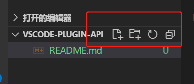
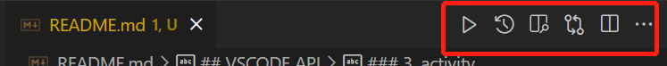
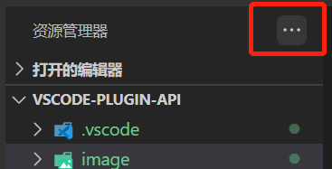
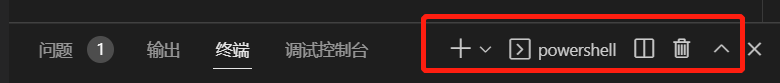

## VSCODE API

### 1. treeView



```typescript
// package.json  contributes menu view/title
"view/title": [
    {
        "command": "nodeDependencies.refreshEntry",
        "when": "view == nodeDependencies",
        "group": "navigation"
    }
]
```

### 2. editorTitle



```typescript
// package.json  contributes menu editor/title

vscode.commands.executeCommand('setContext', 'show', true);

"editor/title": [
  {
    "command": "nodeDependencies.refreshEntry",
    "when": "show",
    "group": "navigation"
  }
]
```

### 3. activity

#### 1. treeView SidePart



#### 2. treeView RightSidePart

#### 3. treeView Part


