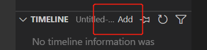
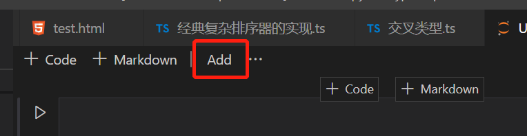

## VSCODE API

### 1. treeView


```typescript
// package.json  contributes menu view/title
"view/title": [
    {
        "command": "nodeDependencies.refreshEntry",
        "when": "view == nodeDependencies",
        "group": "navigation"
    }
]
```

### 2. editorTitle


```typescript
// package.json  contributes menu editor/title

vscode.commands.executeCommand('setContext', 'show', true);

"editor/title": [
  {
    "command": "nodeDependencies.refreshEntry",
    "when": "show",
    "group": "navigation"
  }
]
```

### 3. activity

#### 1. treeView SidePart


#### 2. treeView RightSidePart

#### 3. treeView Part


### 4. timeline



```typescript
// package.json  contributes menu timeline/title

"timeline/title": [
  {
    "command": "nodeDependencies.addEntry",
    "when": "show",
    "group": "navigation"
  }
]

// 右键
"timeline/item/context":[
  {
    "command": "nodeDependencies.addEntry",
    "when": "show",
    "group": "navigation"
  }
]
```

### notebook



```typescript
// package.json  contributes menu notebook/toolbar

"notebook/toolbar":[
  {
    "command": "nodeDependencies.addEntry",
    "when": "show",
    "group": "navigation"
  }
]
```

### when

当 `when` 为 `false` 时，actionViewItem 不展示，直接删除 dom 上的节点，而不是设置样式隐藏该节点
